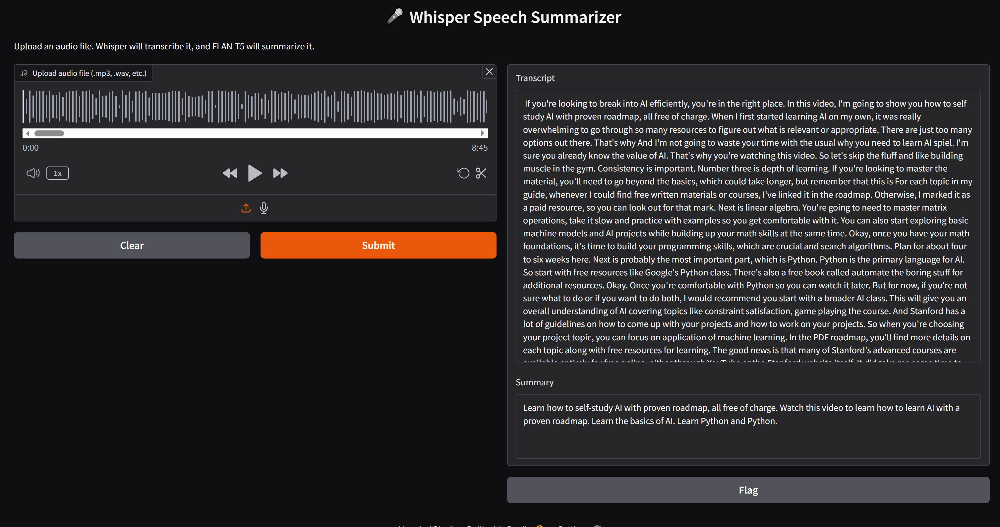

# AudioGist

AudioGist is a ASR-NLP ML pipeline that transcribes audio to text and generates summaries

Built using **PyTorch** and **Hugging Face Transfomers** with OpenAI's **Whisper** model for speech recognition and Google's **Flan-T5** (small) model for text generation.
AudioGist is deployed as an interactive web app with **Gradio** in Hugging Face Spaces.

---

## Demo

👉 [Try AudioGist live on Hugging Face Spaces](https://huggingface.co/spaces/wujingg/AudioGist)

Upload audio and get the gist.

## Tech Stack

- Python
- PyTorch
- Hugging Face Transformers
- Gradio

---

